# 🎲 D&D Management System - Proyecto Fin de Grado

### Desarrollado por Mateo Sáez

Como jugador de Dungeons & Dragons, he observado que las sesiones de juego se suelen alargar, dado que hay ocasiones en las que hay que sumar muchos bonificadores, ya sea en una tirada común como en un combate. El fin de este proyecto es facilitar la gestión de partidas de D&D (forma abreviada de Dungeons & Dragons). Permite tanto a Dungeon Masters como a Jugadores llevar un control exhaustivo de sus campañas, personajes y combates de una forma intuitiva y dinámica.

**URL del Proyecto:** [https://extraordinary-analysis-production.up.railway.app](https://extraordinary-analysis-production.up.railway.app)

---

## 🚀 Resumen: ¿Para qué sirve?

La aplicación nace de la necesidad de agilizar la experiencia de juego en mesa, ya que las tiradas y los cálculos suelen ocupar una parte importante de la sesión, dejando el roleo a un segundo plano. Esta aplicación sirve como un apoyo el cual complementa la hoja de papel tradicional, permitiendo:
- **Automatización de cálculos:** Olvida sumar manualmente bonificadores; la app lo hace por ti.
- **Historial de daods:** Registro en tiempo real de todas las tiradas de dados en una campaña, ya sean habilidad, salvación o combate.
- **Gestión centralizada:** Todo lo necesario para una sesión de juego en un solo lugar, accesible desde cualquier ordenador.

---

## 🛠️ Tecnologías Usadas

El proyecto utiliza un conjunto de tecnologías moderno y robusto para garantizar rendimiento y escalabilidad:

### Frontend
- **React 18**: Biblioteca principal para la interfaz de usuario.
- **TypeScript**: Para un desarrollo seguro y tipado.
- **Vanilla CSS**: Estilos personalizados con un enfoque en diseño premium y oscuro (glassmorphism).
- **Vite**: Herramienta de construcción y desarrollo ultra rápida.

### Backend
- **Symfony 7 (PHP 8.2)**: Framework de alto rendimiento para la API.
- **MySQL 8.0**: Base de datos relacional para la persistencia.
- **Doctrine ORM**: Mapeo de objetos para la base de datos.
- **LexikJWTAuthentication**: Seguridad basada en tokens JWT para la autenticación.

### Infraestructura
- **Docker & Docker Compose**: Contenedores para asegurar que el proyecto funcione igual en cualquier entorno.
- **Nginx**: Servidor web para el frontend.
- **Apache**: Servidor de aplicaciones para el backend.
- **Railway**: Plataforma PaaS para el despliegue continuo según se vaya subiendo código.

---

## 📊 Modelo Entidad-Relación

El diseño de la base de datos ha sido optimizado para soportar la complejidad de las reglas básicas de D&D, permitiendo relaciones dinámicas entre personajes, habilidades y ataques.

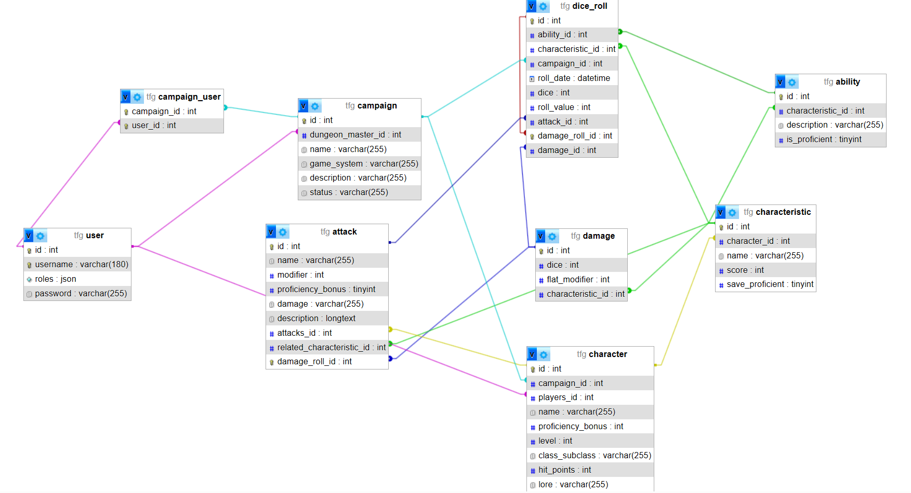

---

## 📋 Tablas de la Base de Datos

El esquema se compone de las siguientes tablas principales:

- **`user`**: Almacena las credenciales y roles de los usuarios.
- **`campaign`**: Información de las partidas (DM, sistema, estado).
- **`character`**: Hojas de personaje con estadísticas base e historia.
- **`characteristic`**: Puntuaciones de Fuerza, Destreza, etc., y sus respectivas salvaciones.
- **`ability`**: Habilidades específicas (Acrobacias, Atletismo, etc.) junto a la competencia en cada habilidad.
- **`attack`**: Configuración de ataques personalizados.
- **`damage`**: Definición de dados de daño y modificadores.
- **`dice_roll`**: Registro histórico de todas las tiradas efectuadas.

---

## 👥 Roles de Usuario

La aplicación distingue dos roles fundamentales:

### 1. Jugador (Player)
- Crea y personaliza sus propias hojas de personaje según sean las necesidades de la partida.
- Sube de nivel y actualiza estadísticas en tiempo real.
- Realiza las tiradas de habilidad, salvación y ataque con un solo click.
- Ve sus propios ataques y bonificadores calculados automáticamente.

### 2. Master (Dungeon Master)
- Crear y gestionar múltiples campañas.
- Invita a jugadores a sus campañas.
- Supervisa las hojas de personaje de todos sus jugadores.
- **Historial de Tiradas:** Visualizar en tiempo real los resultados de los dados de todos los jugadores de la mesa.

---

## 🚢 Despliegue y Dockerización

El proyecto está totalmente **dockerizado**, lo que facilita su despliegue y ejecución local.

### Dockerización
Se han creado sendos `Dockerfile` específicos para cada servicio:
- **Backend**: Utiliza una imagen optimizada con PHP 8.2 y Apache. Configura automáticamente el entorno de producción y genera las llaves JWT.
- **Frontend**: Utiliza una build multi-etapa. Primero compila el código React y luego lo sirve mediante **Nginx**.

Posteriormente, se ha creado un archivo `docker-compose.yml` que permite levantar el proyecto localmente con todos los servicios necesarios.

### Railway
El despliegue se realiza en Railway mediante la conexión directa con GitHub, configurando servicios independientes para el Frontend, Backend y MySQL, comunicados a través de variables de entorno seguras.

---

## 💡 Casos de Uso (User Stories)

| Rol | Acción | Resultado esperado |
| :--- | :--- | :--- |
| **Jugador** | Click en "Atacar con Espada Larga" | El sistema calcula `1d20 + Bono Competencia + Mod. Fuerza` y registra el resultado. |
| **Jugador** | Subir las características | Los bonificadores de las habilidades y tiradas de salvación se actualizan automáticamente. |
| **Master** | Crear Campaña | Se genera un espacio de juego donde los jugadores pueden unirse con sus personajes. |
| **Master** | Revisar historial | El DM ve que el Jugador X ha sacado un 20 natural en su última tirada de percepción. |

---

## 📸 Capturas de Pantalla

### Pantalla de inicio
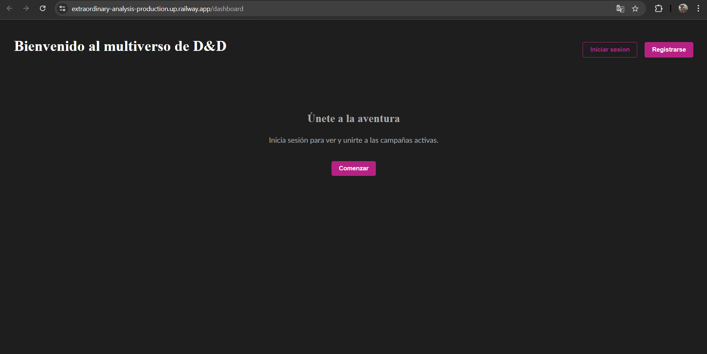

### Login
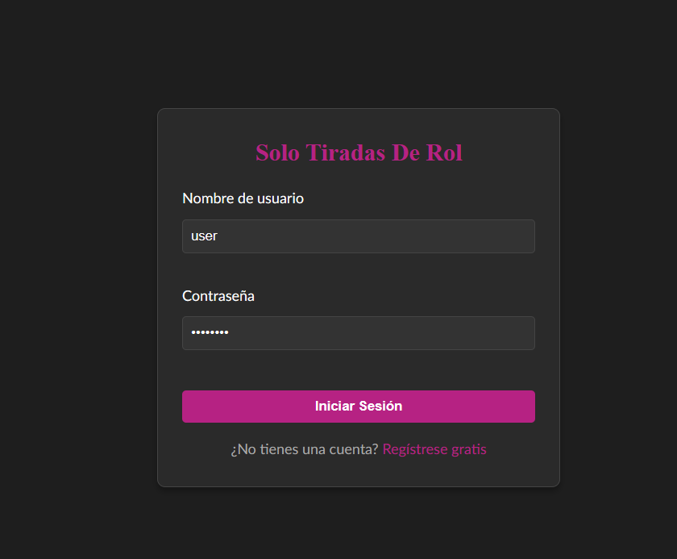

### Registro
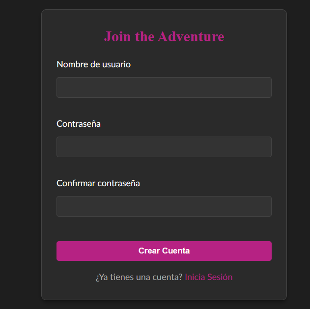

### Dashboard Principal
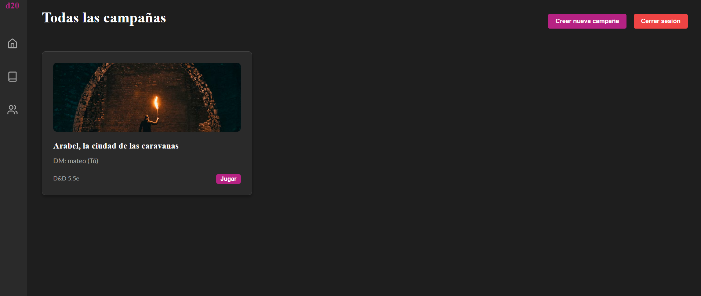

### Visor de personajes creados
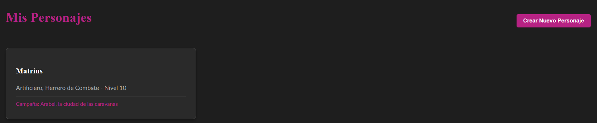

### Hoja de Personaje Detallada
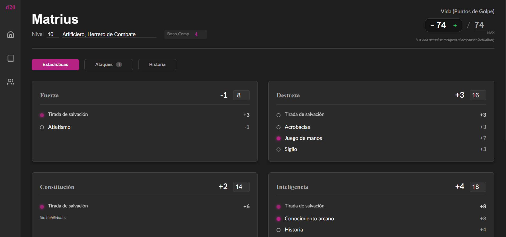

### Gestión de Campaña (Vista DM)
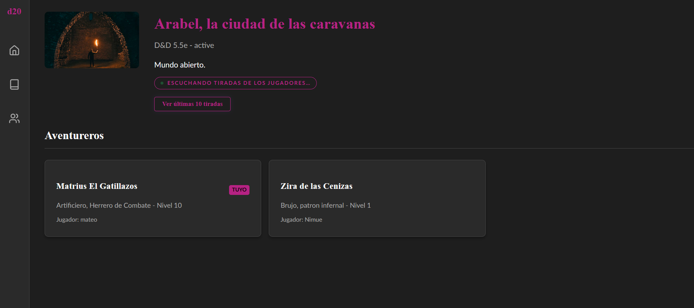

### Historial de Tiradas en Tiempo Real
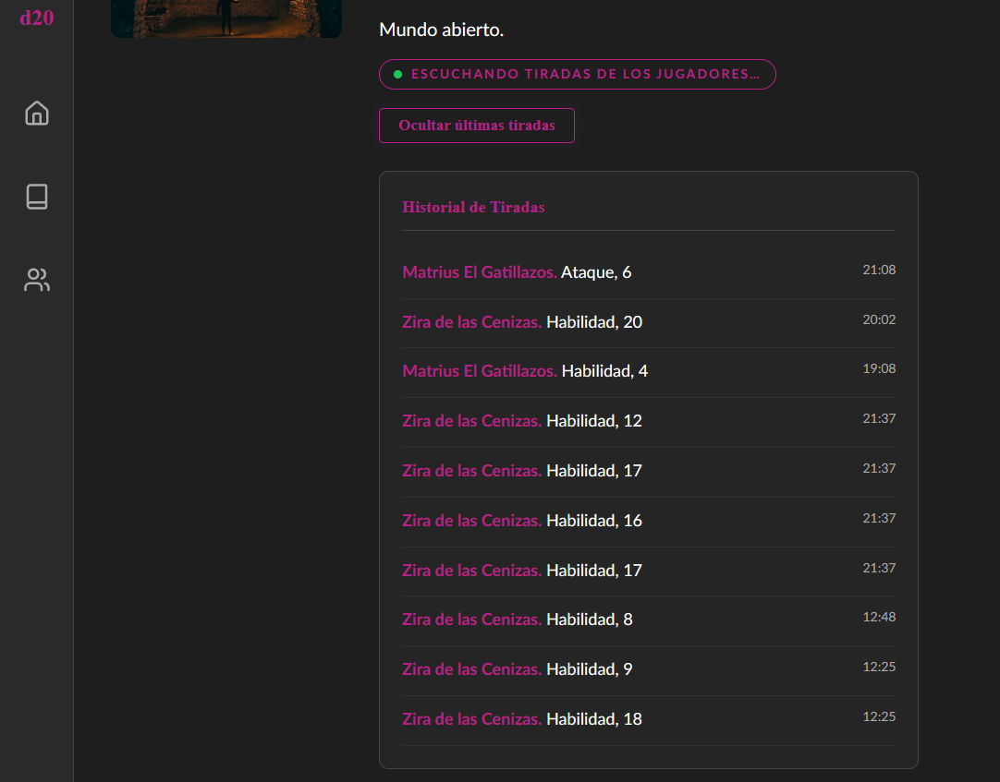

### Configuración de Ataques
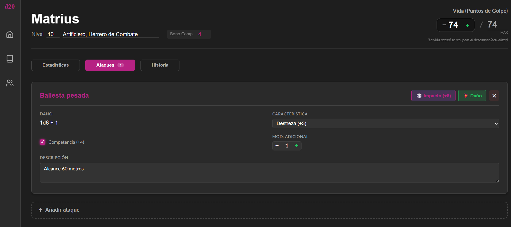

### Creación de Campañas
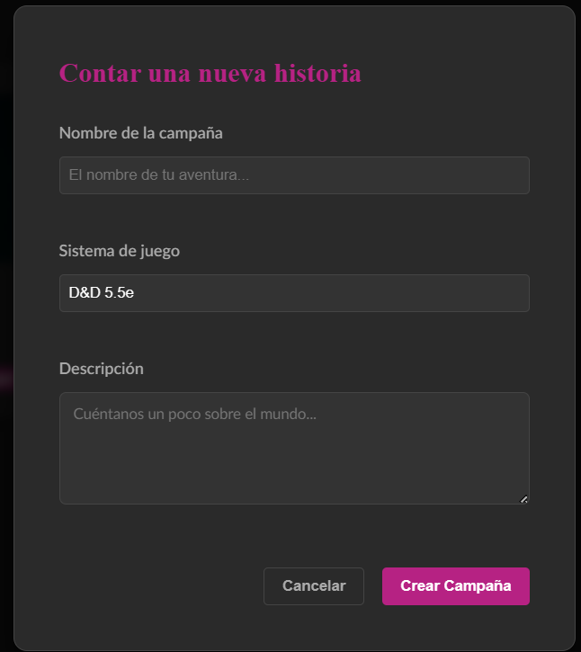

### Creación de Personajes
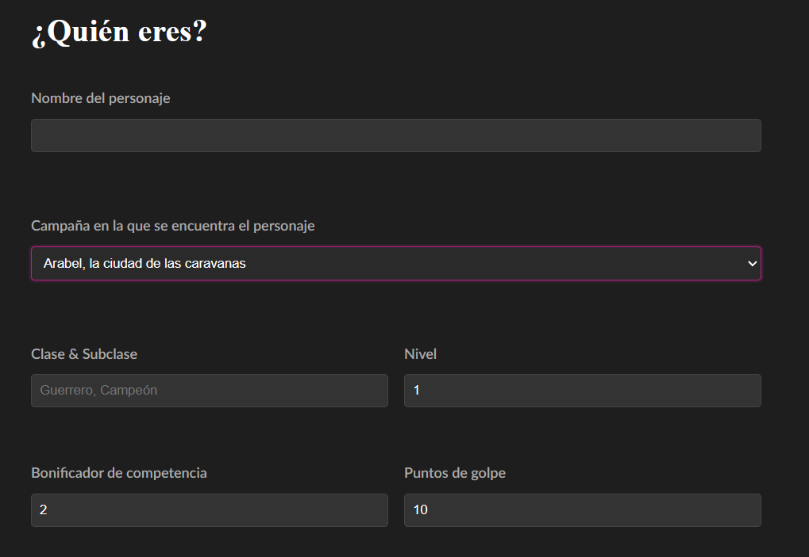
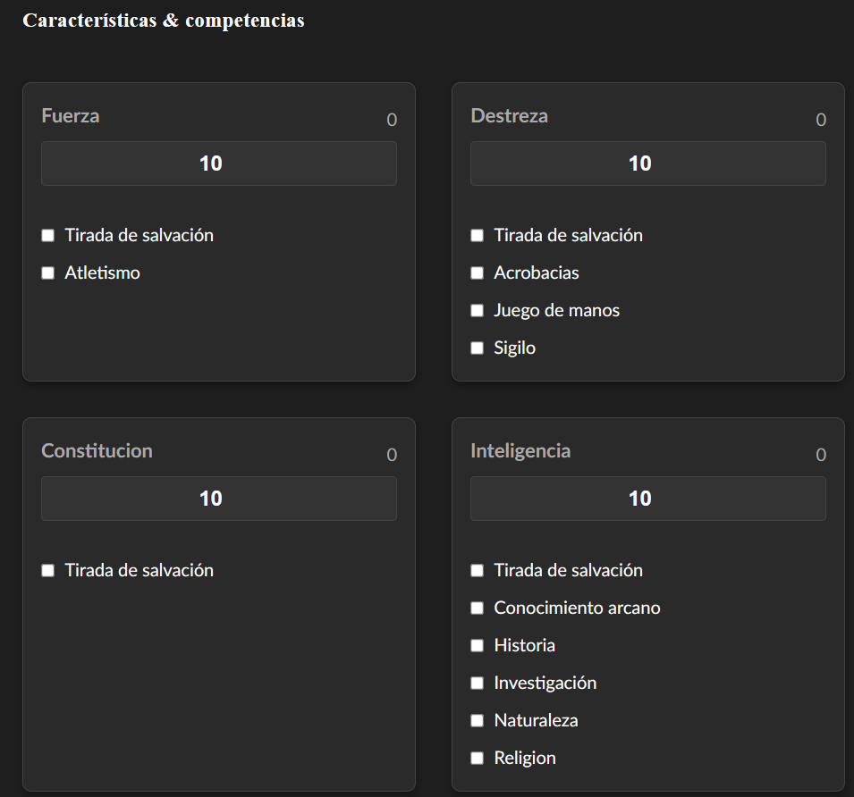
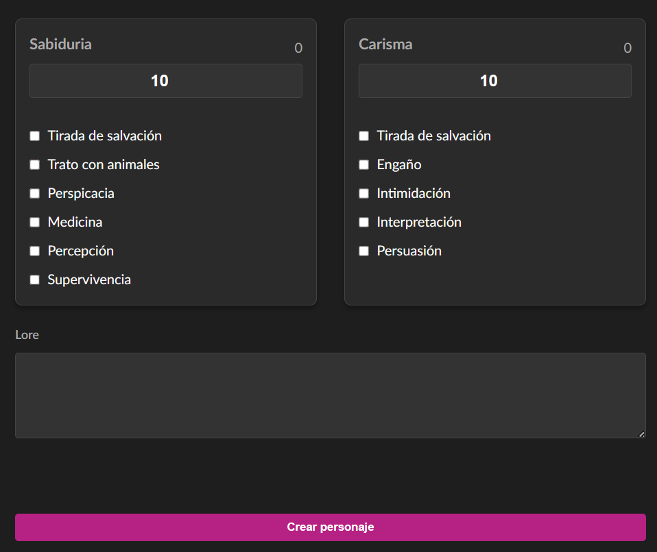

### Añadir ataques a un personaje
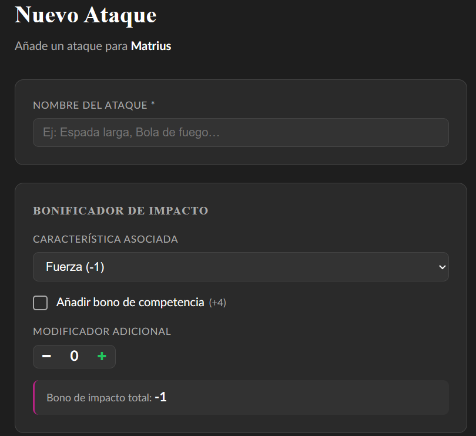
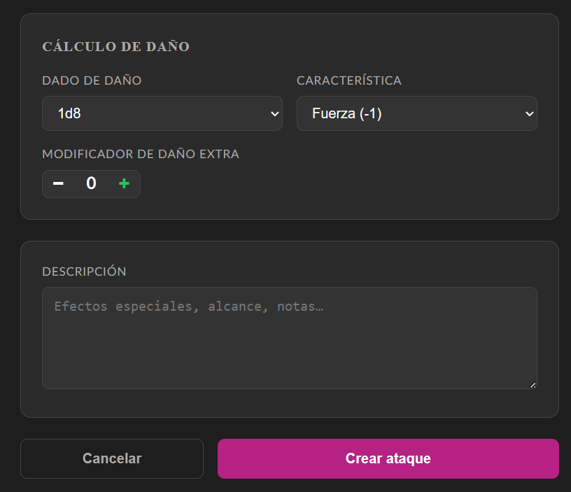

---
*Desarrollado como Proyecto de Fin de Grado por Mateo Sáez - 2026*
